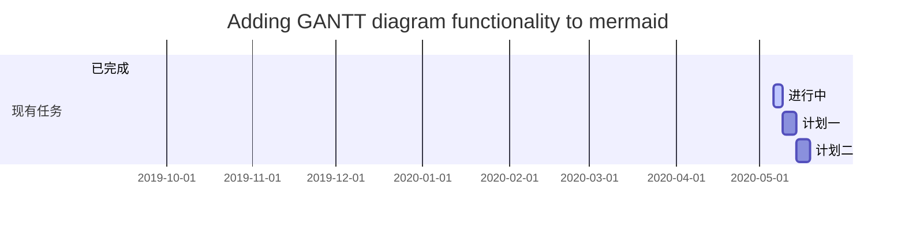

# 关于我在Typora里面学Typora这件事
# 一阶标题 （快捷键Ctrl+1）
## 二阶标题 （快捷键Ctrl+2）
### 三阶标题 （快捷键Ctrl+3）
#### 四阶标题 （快捷键Ctrl+4）
##### 五阶标题 （快捷键Ctrl+5）
###### 六阶标题 （快捷键Ctrl+6）

==（记忆时记得使用ctrl+/切换源代码模式）==
## 关于字体
**这个符号是加粗符号**
*这个是斜体的*
***这个是既加粗还斜体的符号***
==一星斜，二星粗，三星粗斜== 

## 如何生成目录

在文章开始地方输入[toc]，即可在对应位置插入目录

## 下划线

<u>下划线的内容或者快捷键Ctrl+U</u>

## 删除线
删除线使用格式：~~ 删除线的内容~~

## 上下标
我是^上标^ 他是~下标~	
上标用^下标用~
## 列表
创建无序列 :+ 、- （后面加空格）
+ 一二三四五
+ 上山打老虎
  + 试一下二级标题
  + 缩进就是新标题
  + 一定要记住要加空格
    

有序列表可以用数字加空格表示如(1.) Typora

## 列表    ~直接编辑比较简单~

| num  | name | class |
| ---- | ---- | ----- |
|      |      |       |
## 引用
>鲁迅曾经说过“在Typora里面，引用号就是大于号。”

##  代码
`#include <stdio.h>
 int main (){
 	printf("i do not know what i am doing");
 return 0 ;
 }`
 ## 超链接
注：可直接使用ctrl+K[使用超链接]()
也可以在段落里找到链接引用.
也可直接使用<>.
也可以用[]符号与（）符号一起使用内链接

## 任务列表
- [ ] 文字 （注：注意用空格隔开）

[ ] Java
[ ] 大数据
[ ] 人工智能
[ ] 机器学习

## 数学表达式
Typora支持加入用LaTeX写成的数学公式，并且在软件界面下用MathJax直接渲染，数学公式分为两种参考Mathpix Snip

行内公式输入在两个`$$`之间，

行外公式`$$内容公式$$`或`$$`+回车即可输入。

## 关于数学高级运算
。。这一块.

## 表情
:smile: :angry:		//:表情名:，即可实现表情的输入.


## 特殊字符
&copy;      版权      
&reg;       注册商标
&trade;     商标
&nbsp;      空格
&amp;       和号
&quot;      引号
&apos;      撇号
&lt;        小于号
&gt;        大于号
&ne;        不等号
&le;        小于等于
&ge;        大于等于
&cent;      分
&pound;     磅
&euro;      欧元
&yen;       元
&sect;      节
&times;     乘号
&divide;    除号
&plusmn;    正负号

## Mermaid流程图
   ``` mermaid
	graph LR
	graph LR
	A[老鹰]--吃--> B((小鸡))
	A --吃--> C(蛇)
	B --吃--> D{虫}
	C --> D
   ```

## 甘特图


## 饼图
饼图使用 pie 表示，标题下面分别是区域名称及其百分比。

pie
    title Key elements in Product X
    
   "Calcium" : 42.96
   
   "Potassium" : 50.05
   
   "Magnesium" : 10.01
   
   "Iron" :  5

### 后话
我真不知道Typora有什么很多需要学习的产出笔记。。。毕竟Typora对于我这个小白来说是一个简洁的更加易使用的Word。看到群里那个1500的吓死我了。。不知道该怎么写。是我不配了
  只需要记一些简单的操作就足以独自写一个 “考核任务书”了。
原理，，我认为现阶段对于我来说不会看懂，用处不大，日后再看。

（关于Typora的学习产出笔记~~确实连我自己都觉得有点水~~就到这了。关于更加详细的操作，就看git和github 的学习产出笔记吧）
